<!-- The Grimoire of Vishal Verma. All artwork in /assets is original SVG. -->

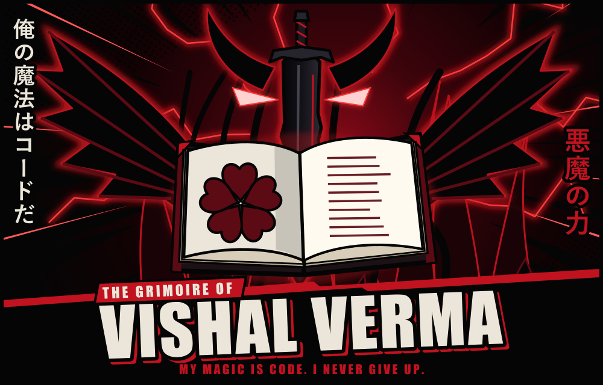

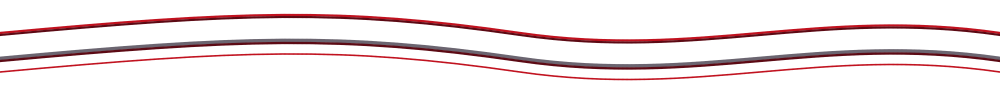

 

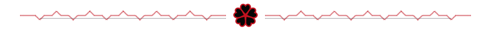

<h3 align="center">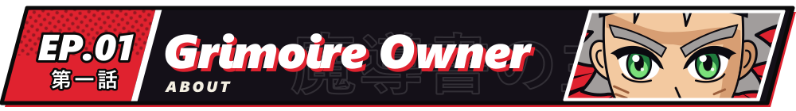</h3>

**Vishal Verma**, AI/ML engineer from Gurugram, India

- **Academy:** B.Tech CSE (AI/ML), BML Munjal University, class of 2028
- **Squad:** AI/ML Intern, Hughes Systique (May 2025 – Jul 2026)
- **Ultimate quest:** building intelligent systems for space at **ISRO**
- **Casting now:** multi-agent RAG systems and end-to-end ML pipelines
- **Studying:** agentic AI, MLOps, and data structures & algorithms in Java
- **Exploring:** satellite imagery and remote sensing with deep learning

<h3 align="center"></h3>

<table>
<tr>
<td width="50%" valign="top" align="center">

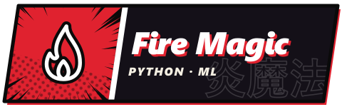

</td>
<td width="50%" valign="top" align="center">

</td>
</tr>
<tr>
<td width="50%" valign="top" align="center">

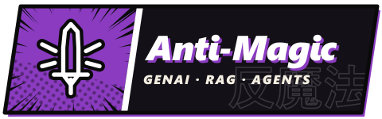

</td>
<td width="50%" valign="top" align="center">

</td>
</tr>
</table>

<h3 align="center">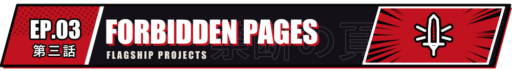</h3>

<table>
<tr>
<td width="50%" valign="top" align="center">

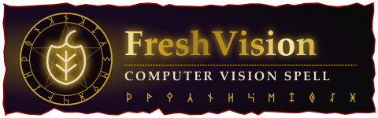

Identifies 14 kinds of fruit and vegetables from a photo and grades their freshness on five levels.

 Academic thesis with Harshul Saini, supervised by Dr. Aurobindo Behera

</td>
<td width="50%" valign="top" align="center">

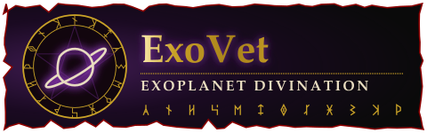

Classifies NASA Kepler objects of interest as planet candidates or false positives.

</td>
</tr>
<tr>
<td width="50%" valign="top" align="center">

Detects scam and phishing SMS in English, Hindi and Hinglish, and shows the words that gave it away.

</td>
<td width="50%" valign="top" align="center">

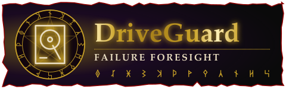

Predicts hard-drive failures from fleet telemetry and ranks which drives to replace each month.

 Team project, four members

</td>
</tr>
<tr>
<td width="50%" valign="top" align="center">

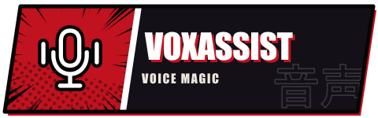

Voice-driven AI assistant.

</td>
<td width="50%" valign="top" align="center">

Multi-agent RAG copilot for space research.

</td>
</tr>
</table>

**Also inscribed**

- [**Thermal-Sight**](https://github.com/2ViShAlv1/Thermal-Sight): satellite thermal-anomaly classification for Smart India Hackathon 2026. 88,434 raw detections reduced to 238 industrial sites, with 0.914 macro-F1 on an unseen region. `XGBoost` `DBSCAN` `FastAPI` `React`
- [**StartupShield AI**](https://github.com/2ViShAlv1/StartUpShield): explainable 0–100 startup risk scoring from churn, sentiment, anomalies and forecasts. `LightGBM` `SHAP` `Prophet` `Streamlit` ([live demo](https://startupshield.streamlit.app/))

<b>Lesser incantations</b> (open-source repositories)

 

| Spell | What it does | Stack |
|---|---|---|
| [Data Cleaning using Python](https://github.com/2ViShAlv1/Data-Cleaning-using-Python) | Notebook walkthrough of real-world data cleaning | `Pandas` `NumPy` |
| [News Fetcher](https://github.com/2ViShAlv1/News-Fetcher-using-Python---NewsAPI) | Pulls and filters live headlines through NewsAPI | `Python` |
| [Sudoku Solver](https://github.com/2ViShAlv1/Suduko-Solver) | Backtracking solver for any valid 9×9 grid | `Java` |
| [Smart Water Leakage Detection](https://github.com/2ViShAlv1/Smart-Water-Leakage-Detection-System) | Flags anomalous flow patterns to catch leaks early | `C++` `Sensors` |
| [IronRide](https://github.com/2ViShAlv1/IronRide) | Full-stack web application with an interactive UI | `JavaScript` |
| [PDF Merger](https://github.com/2ViShAlv1/PDF-Merger) | Merges multiple PDFs into one document | `Python` `PyPDF2` |

<h3 align="center">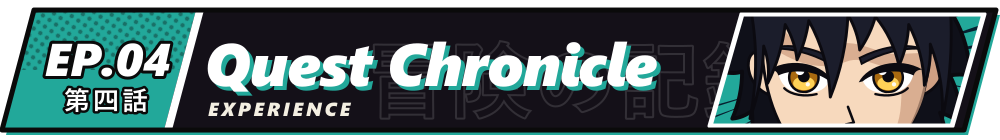</h3>

| Guild | Role | Period |
|---|---|---|
| **Hughes Systique Pvt. Ltd.** | AI/ML Intern. End-to-end ML pipelines, feature engineering, evaluation and MLOps in production. | May 2025 – Jul 2026 |
| **Agnirva Space Internship Program** | Space Technology Intern. Satellite systems, remote sensing, orbital mechanics and mission design. | Aug 2025 |
| **Internshala** | Student Partner. Promoted internships and skill programs across campus. | Apr 2026 |

**Seals earned:** Python (Basic), HackerRank (`326AD1CE7806`) · The Ultimate Job Ready Data Science Course, CodeWithHarry

<h3 align="center">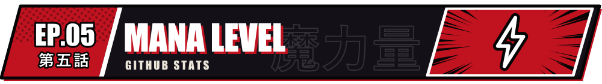</h3>

<h3 align="center">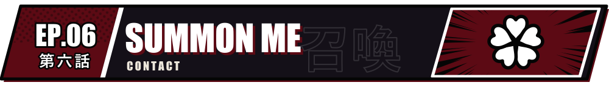</h3>

**Got a quest or a wild idea? Call me in.**

Unofficial fan theme inspired by Black Clover (Yūki Tabata, Shueisha). All artwork is original SVG.

